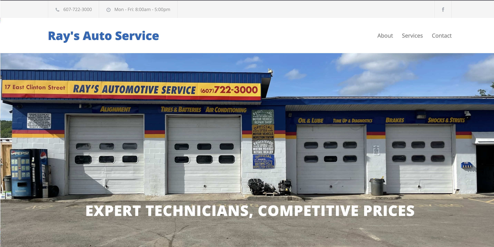
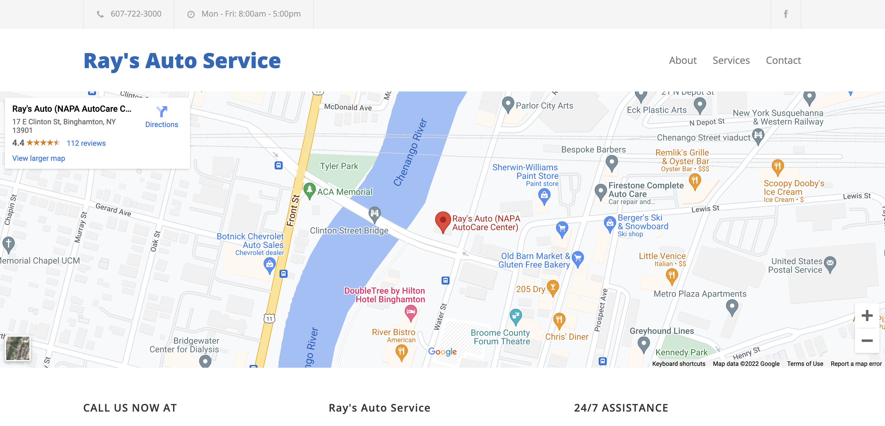

# Ray's Auto Service

This is the production repo for a freelance client of mine's website. The client is an auto repair shop & towing service located in Binghamton, NY.

I used eleventy -a static site generator, and deployed it on netlify.

[Live Site](https://rays-auto.netlify.app/)

## How It's Made:

**Tech used:** HTML, CSS, JavaScript, EJS, Eleventy

They wanted a fairly basic site, so I mostly used regular HTML/CSS. 

I also decided to use eleventy, a static site generator. I made this decision because I wanted to add a semblance of modularity to the code. Since this site doesn't use react or anything, making changes was tiresome. For example to update the header, which is displayed on every page, it involved hunting down code in every separate HTML file for each individual page.
Eleventy allowed me to use EJS partials, which in a way are like components in react. Then I was able to only write the code for the header in one file, and include it on each page.. much better!

<!-- ## Optimizations

_(optional)_

You don't have to include this section but interviewers _love_ that you can not only deliver a final product that looks great but also functions efficiently. Did you write something then refactor it later and the result was 5x faster than the original implementation? Did you cache your assets? Things that you write in this section are **GREAT** to bring up in interviews and you can use this section as reference when studying for technical interviews! -->

## Lessons Learned:

This was my first time using a static site generator, and it was definitely worth the time it took to learn how to use eleventy. It's a nice option for a simple static site or something like a blog, however react would be better for more complex UIs/apps.

I also wasted a good amount of time trying to work with the google maps API, before realizing it was 1000x easier and just as effective (in this particular use-case) to simply embed an iframe to display the google map (see below).

